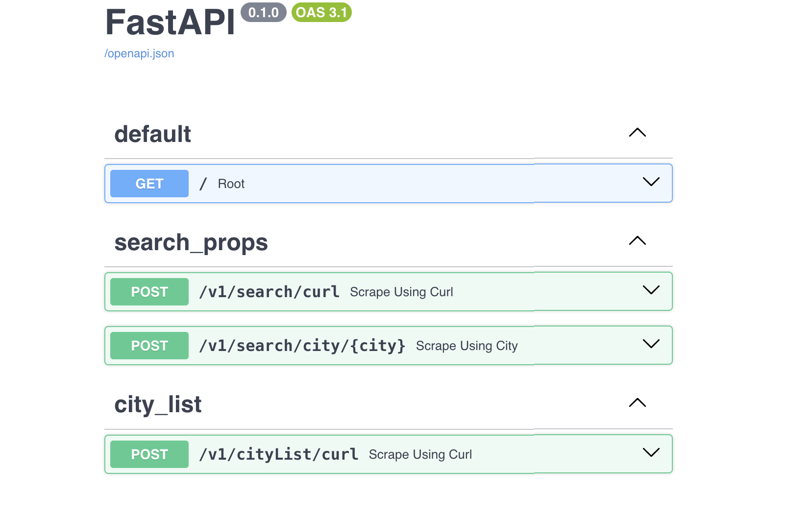

# Scrape Housing.com

<p align="center">
  
</p>

This is a API by which you can scrape data from [housing.com](https://www.housing.com) by specifying the name of the city.

## Usage

1. Create a virtual environment and install the all requirements of the project:

   ```bash
   pip install -r requirements.txt
   ```

2. Run the FastAPI instance using `make` command:

   ```bash
   uvicorn app:app  # actual command

   make api  # reccommended command
   ```
